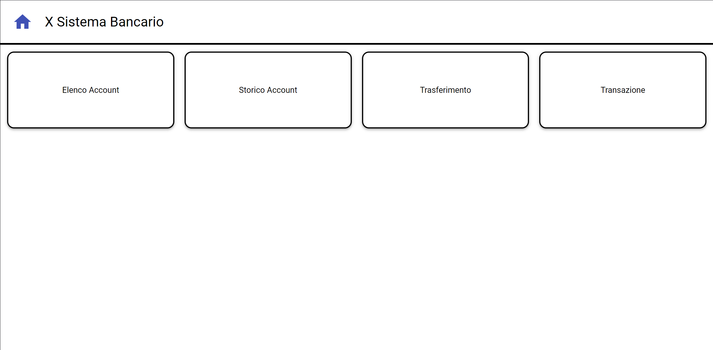
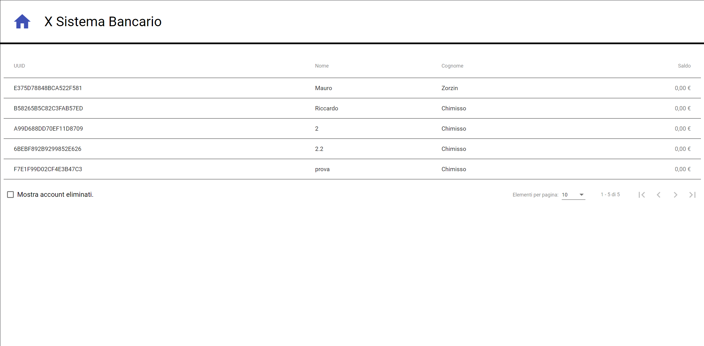
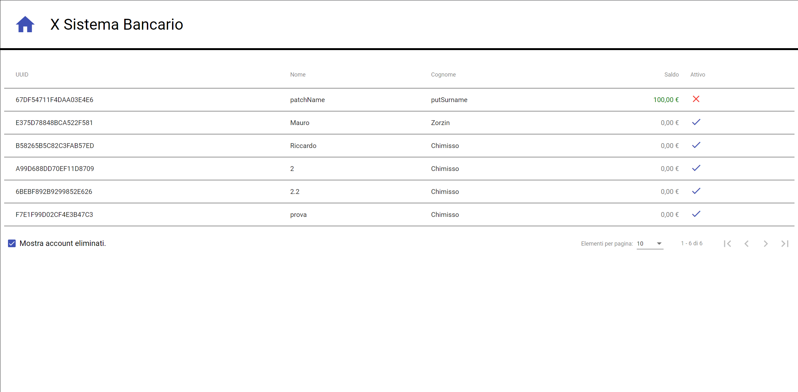
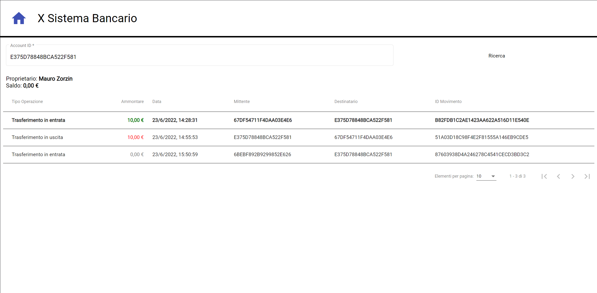
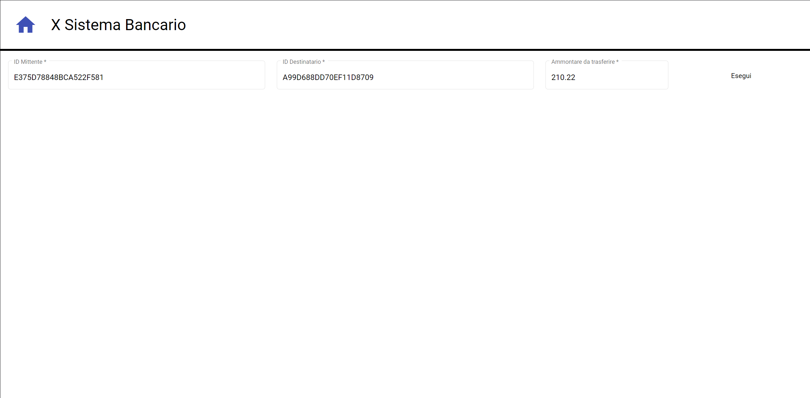
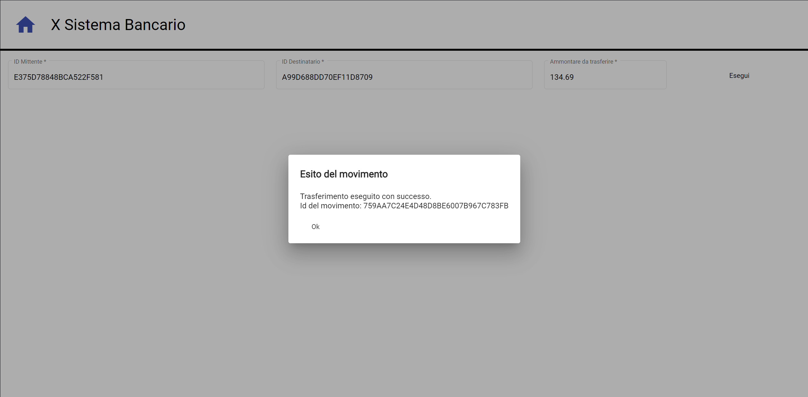
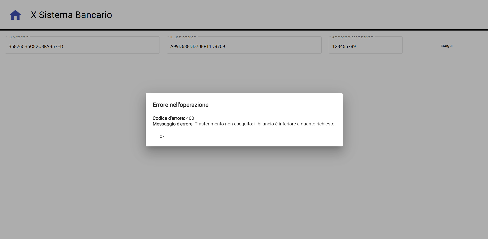
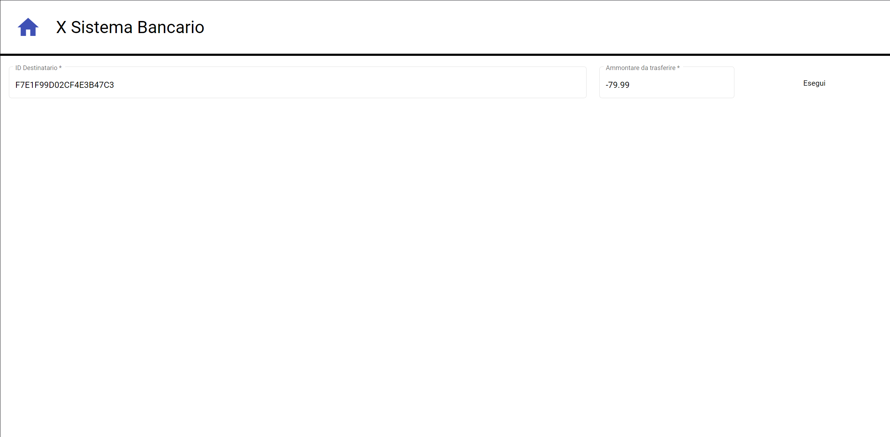

## Sviluppo
Sviluppato e testato su un sistema Windows 10 a 64 bit.  
L'editor principale e consigliato è Visual Studio Code.  

***Va segnalato, tra gli aspetti importanti, il sistema operativo e l'architettura della CPU che sono stati utilizzati per lo sviluppo, spiegando come installare eventuali dipendenze esterne del progetto.***

---
## Installazione

- Visual Studio
- NodeJs
- Java 17
- Browser
- Postman


---

## Esecuzione
- Avvio BackEnd:
  - L'anciare l'applicazione Java, il Database verra inizializato al primo avvio.
- Avvio FrontEnd:
  - eseguire in comando npm start.
  - se il sistema richiede i permessi di privacy inserire n e premere invio.

---

## Testing


### Web App
Una volta che il servizio è stato avviato è possibile connettersi alla pagine :   

### HOME [/home](http://localhost:4200/home)



Dalla Home è possibile accedere agli altri servizi.  
Schiacciando sulla piccola casetta in alto a sinistra è possibile tornare a questa pagina in qualsiasi momento.


Dal menù si può accedere partendo da sinistra a:
### Elenco account [/accounts-list](http://localhost:4200/accounts-list)

In questa pagina è posibile visualizzare le informazioni di tutti gli acount nel sistema (UUID, Nome, Cognome, Saldo).

Attivando la piccola checkbox in basso a sinistra e possibile vidualizzare anche tutti gli account eliminati. la checkbox mantiene il suo stato anche quando si lascia la pagina.



### Storico account [/](http://localhost:4200)
In questa pagina è posibile inserire un UUID all'interno di un' apposita casella (AccountID), schiacciando sulla casella il sistema elenca già tutti gli account validi presenti nel sistema, è anche possibile digitare perte di un UUID, il sistema eseguira una rigerca elencado solo gli UUID che cominciano con la stringa inserita.  

Se la stringa inserita è valida sara possibile clicare il tasto cerca sulla destra, verranno poi visualizzate tutte le informazioni dell'account inserito.




### Trasferimento [/transfer](http://localhost:4200/transfer)
In questa pagina è posibile eseguire un trasferimento di denaro da un account ad un altro.

Si inseriscono i due UUID nelle apposite caselle ID Mittente e ID Destinatario (tali caselle funzionano similmente a quelle desctitte in Storico Account).   
Si speciffica la quantità che si desidera trasferire (quantità sempre positiva).   
Si clicca sul pulsante Esegui.

In base ad alcuni fattore il sistema restituira Un messaggio di conferma se l'operazione è andata a buon fine o di errore se il saldo del mittente non è sufficente per eseguire il trasferimento.



Messaggio di conferma


Messaggio di errore


### Tranzazione [/transaction:](http://localhost:4200//transaction)
In questa pagina è posibile eseguire una transazione ovvero un deposito o un prelievo.

Si inserisce l'UUID dell'account nell'apposito campo, similmente a come avviente nelle altre pagine.   
Si specifica l'ammontare della tranzazione,
positivo per un deposito negativo per un prelievo.   
Si clicca sul pulsante Esegui.   

In base al saldo dell'account un prelievo potrebbe fallire con relativo messaggio di errore se il saldo è insufficente per eseguire l'operazione.




----

### API
  Quelle che seguono sono un insieme di chiamate e risposte test, che abbiamo svolto, con alcuni commenti sui campi aggiuntivi e modifiche fatte da noi. 
  
     
  Le chiamate sono in ordine cronologico e contengono gli effettivi id chiamati,  tutte le chiamate sono state eseguite manualmente attraverso Postman.

  Legenda:*

  - *requestBody* = Il contenuto della richiesta in formato JSON.

  - *responseBody:* = Il contenuto della risposta in formato JSON.

  - *response* = Il codice di risposta atteso per la richiesta.   

  - *allResponse* = Tutti i codici di risposta attesi per quella chiamata in base al contesto da noi implementati.


  (Commenti indicati con //)

---
- **POST("/api/account"):**  
Crea un nuovo account.

  - *requestBody:* 
    ```json
    {
      "name": "name",
      "surname" : "surname"
    }
      ```
  - *responseBody:*
    ```json
    {
      "message": "Account creato con successo.",
      "id": "67DF54711F4DAA03E4E6"
    }
    ```
  - *response:*   
    - [201(Created)](https://datatracker.ietf.org/doc/html/rfc7231#section-6.3.2) :    
  Account creato correttamente.

  - *allResponse:*  
    - [400(Bad Request)](https://datatracker.ietf.org/doc/html/rfc7231#section-6.5.1) :   
  Le credeziali non sono valide.     
  Manca name o surname o entrambe.
  
---
- **GET("api/active")**   
Mostra tutti gli account attivi nel sistema eccetto quelli eliminati.

    - *requestBody:*  
    
    - *responseBody:*  
      ```json
      [
        {
          "name": "name",
          "surname": "surname",
          "balance": 0.0,

          //Indica se l'account è stato eliminato
          "deleted": false,

          "uuid": "67DF54711F4DAA03E4E6"
        },
        {
          "name": "Mauro",
          "surname": "Zorzin",
          "balance": 0.0,
          "deleted": false,
          "uuid": "E375D78848BCA522F581"
        },
        {
          "name": "Riccardo",
          "surname": "Chimisso",
          "balance": 0.0,
          "deleted": false,
          "uuid": "B58265B5C82C3FAB57ED"
        }
      ]
      ```
  - *response:*   
    - [200(OK)](https://datatracker.ietf.org/doc/html/rfc7231#section-6.3.1) :   
  Vengono restituire le informazioni.   

  - *allResponse:* 
---
- **POST("/api/account/67DF54711F4DAA03E4E6")**  
Esegue un deposito o un prelievo per un creciso account.


  - *requestBody:* 
    ```json
    {
      "amount": 100
    }
    ```

  - *responseBody:* 
    ```json
    {
      "message": "Transazione eseguita con successo.",
      "id": "B6895F2BC3B946B0BC1013FCA4D5D9B4",
      "movementActor": 
        {
          "newBalance": 100.0,
          "uuid": "67DF54711F4DAA03E4E6"
        }
    }
    ```
  - *response:*   
    - [201(Created)](https://datatracker.ietf.org/doc/html/rfc7231#section-6.3.2) :    
La tranzazione viene creata e registrata nel sistema.

  - *allResponse*   
    - [400(Bad Request)](https://datatracker.ietf.org/doc/html/rfc7231#section-6.5.1) :   
    Le credeziali non sono valide.   
    L'id non è in un formato accettabile. 
    - [404(Not Found)](https://datatracker.ietf.org/doc/html/rfc7231#section-6.5.4) :   
    L'id specificato non esiste o è stato cancellato.

---
- **POST("/api/transfer")**  
Esegue un trasferimento di denaro da un account ad un altro.

  - *requestBody:*  
    ```json
    {
      "amount": 10,
      "from": "67DF54711F4DAA03E4E6",
      "to": "E375D78848BCA522F581"
    }
    ```
  - *responseBody:*  

    ```json
    {
      "message": "Trasferimento eseguito con successo.",
      "id": "B82FDB1C2AE1423AA622A516D11E540E",
      "sender": 
        {
          "newBalance": 90.0,
          "uuid": "67DF54711F4DAA03E4E6"
        },
      "recipient": 
        {
          "newBalance": 10.0,
          "uuid": "E375D78848BCA522F581"
        }
    }
    ```
  - *response:*   
    - [201(Created)](https://datatracker.ietf.org/doc/html/rfc7231#section-6.3.2) :    
Il trasferimento è stato eseguito e la risorsa è stata creata.

  - *allResponse:*   
    - [400(Bad Request)](https://datatracker.ietf.org/doc/html/rfc7231#section-6.5.1) :   
    Le credeziali non sono valide.   
    Gli id non sono in un formato accettabile.
    Il bilancio dell'account non permette l'operazione.  
    - [404(Not Found)](https://datatracker.ietf.org/doc/html/rfc7231#section-6.5.4) : L'id specificato non esiste o è stato cancellato.

---
- **PUT("api/account/67DF54711F4DAA03E4E6")**  
Modifica il nome e il cognome di un account.

  - *requestBody:* 
    ```json
    {
      "name": "putNome",
      "surname": "putSurname"
        
    }
    ```
  - *responceBody:*

  - *response:*   
      - [204(No Content)](https://datatracker.ietf.org/doc/html/rfc7231#section-6.3.5) :   
       Richiesta riuscita, body vuoto.

  - *allResponse:*   
    - [400(Bad Request)](https://datatracker.ietf.org/doc/html/rfc7231#section-6.5.1) :   
    Le credeziali non sono valide.   
    L'id non è in un formato accettabile.  
    Manca o name o surname  o entrambi.   
    - [404(Not Found)](https://datatracker.ietf.org/doc/html/rfc7231#section-6.5.4) : L'id specificato non esiste o è stato cancellato.   
---
- **PATCH("api/account/67DF54711F4DAA03E4E6")**  
Modifica il nome o il congome di un account.   

  - *requestBody:* 
    ```json
    {
        "name": "patchName",  
    }
    ```
  - *responseBody:* 
  - *response:*   
      - [204(No Content)](https://datatracker.ietf.org/doc/html/rfc7231#section-6.3.5) :    
      Richiesta riuscita, body vuoto.

  - *allResponse:*   
    - [400(Bad Request)](https://datatracker.ietf.org/doc/html/rfc7231#section-6.5.1) :   
    Le credeziali non sono valide.   
    L'id non è in un formato accettabile.  
    Manca name o surname.   
    Sono stati specificati sia name che surname.   
    - [404(Not Found)](https://datatracker.ietf.org/doc/html/rfc7231#section-6.5.4) :    
    L'id specificato non esiste o è stato cancellato.   
---
- **HEAD("api/account?id=67DF54711F4DAA03E4E6")**

  - *requestBody:* 
  - *responseBody:*      
  - *response:*   
    - [200(OK)](https://datatracker.ietf.org/doc/html/rfc7231#section-6.3.1) :   
  Vengono restituire informazioni nell'header.

  - *allResponse:*   
    - [400(Bad Request)](https://datatracker.ietf.org/doc/html/rfc7231#section-6.5.1) :   
    Le credeziali non sono valide.   
    l'id non è in un formato accettabile. 
    - [404(Not Found)](https://datatracker.ietf.org/doc/html/rfc7231#section-6.5.4) :    
    L'id specificato non esiste o è stato cancellato.  
---
- **POST("/api/divert")**  
Annulla un trasferimento, creando un trasferimento inverso.   

  - *requestBody:* 
    ```json
    {
      "id": "B82FDB1C2AE1423AA622A516D11E540E"    
    }
    ```
  - *responseBody:* 
    ```json
    {
      "message": "Trasferimento eseguito con successo."
    }
    ```
  - *response:*   
    - [201(Created)](https://datatracker.ietf.org/doc/html/rfc7231#section-6.3.2) :    
    Il trasferimento è stato eseguito e la risorsa è stata creata.

  - *allResponse:*   
    - [400(Bad Request)](https://datatracker.ietf.org/doc/html/rfc7231#section-6.5.1) :      
    l'id del trasferimento specificato non è in un formato accettabile.
    Il bilancio dell'account non permette l'operazione. 
    - [404(Not Found)](https://datatracker.ietf.org/doc/html/rfc7231#section-6.5.4) :    
    L'id specificato non esiste.

--- 
- **GET("api/account/67DF54711F4DAA03E4E6")**  
Mostra i dati completi di un account, compreso lo storico di tutte le trasazioni.   

  - *requestBody:* 

  - *responseBody:* 
    ```json
    {
      "message": "Storico dell'account recuperato con successo.",
      "account": 
        {
          "name": "patchName",
          "surname": "putSurname",
          "balance": 100.0,
          "deleted": false,
          "uuid": "67DF54711F4DAA03E4E6"
        },
        "history": 
          [
            {
              "date": "2022-06-23T12:55:53.249+00:00",
              "uuid": "51A03D18C98F4E2F81555A146EB9CDE5",
              "amount": 10.0,
              "sender": "E375D78848BCA522F581",
              "recipient": "67DF54711F4DAA03E4E6"
            },
            {
              "date": "2022-06-23T12:28:31.123+00:00",

                //UUID di un trasferimento.
              "uuid": "B82FDB1C2AE1423AA622A516D11E540E",

              "amount": 10.0,
              "sender": "67DF54711F4DAA03E4E6",
              "recipient": "E375D78848BCA522F581"
            },
            {
              "date": "2022-06-23T12:20:46.253+00:00",

                //UUID di un tranzazione.
              "uuid": "B6895F2BC3B946B0BC1013FCA4D5D9B4",

              "amount": 100.0,
              "sender": null,
              "recipient": null
            }
          ]
      }
    ```
  - *response:*   
    - [200(OK)](https://datatracker.ietf.org/doc/html/rfc7231#section-6.3.1) :   
  Vengono restituire le informazioni.   
  Se sender e recipient sono null si tratta di un prelievo/deposito, altrimenti è un trasferimento.
  - *allResponse:*   
    - [400(Bad Request)](https://datatracker.ietf.org/doc/html/rfc7231#section-6.5.1) :      
    L'id specificato non è in un formato accettabile.
    Il bilancio dell'account non permette l'operazione. 
    - [404(Not Found)](https://datatracker.ietf.org/doc/html/rfc7231#section-6.5.4) :    
    L'id specificato non esiste.
---
- **DEL("api/account?id=67DF54711F4DAA03E4E6")**  
Marchia un account come eliminato. Nessun account può essere effettivamente rimosso dalla base di dati.    
Un servizo bancario non permetterebbe di eliminare trasazioni o account per evitare richi sia di integrita che di frode.   

  - *requestBody:* 
  - *responceBody:*
  - *response:*   
      - [204(No Content)](https://datatracker.ietf.org/doc/html/rfc7231#section-6.3.5) :    
      Richiesta riuscita, body vuoto.

  - *allResponse:*   
    - [400(Bad Request)](https://datatracker.ietf.org/doc/html/rfc7231#section-6.5.1) :     
    L'id non è in un formato accettabile.     
    - [404(Not Found)](https://datatracker.ietf.org/doc/html/rfc7231#section-6.5.4) :    
    L'id specificato non esiste o è stato cancellato.   
---
- **GET("api/account")**  
Mostra tutti gli account nel sistema.

    - *requestBody:* 
    
    - *responceBody:*
      ```json
      [
        {
          "name": "patchName",
          "surname": "putSurname",
          "balance": 100.0,
          "deleted": true,
          "uuid": "67DF54711F4DAA03E4E6"
        },
        {
          "name": "Mauro",
          "surname": "Zorzin",
          "balance": 0.0,
          "deleted": false,
          "uuid": "E375D78848BCA522F581"
        },
        {
          "name": "Riccardo",
          "surname": "Chimisso",
          "balance": 0.0,
          "deleted": false,
          "uuid": "B58265B5C82C3FAB57ED"
        }
      ]
      ```
  - *response:*   
    - [200(OK)](https://datatracker.ietf.org/doc/html/rfc7231#section-6.3.1) :   
  Vengono restituire le informazioni.   

  - *allResponse:* 
---

